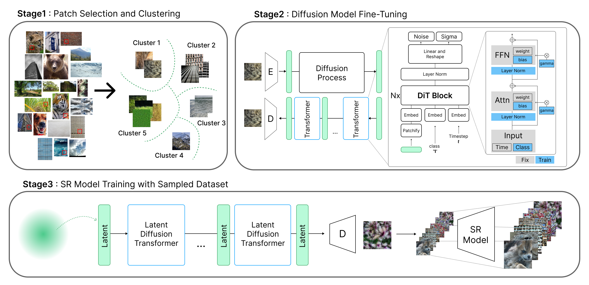
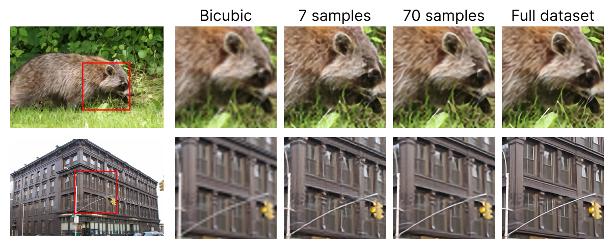
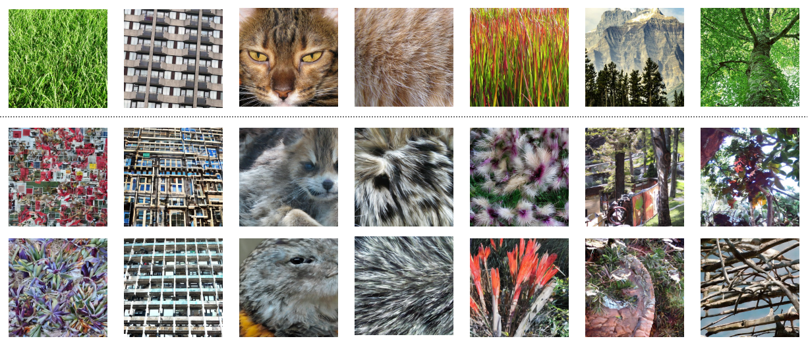

Official implementation of the paper:  
**"Dataset Distillation for Super-Resolution without Class Labels and Pre-trained Models"**  
<sub>*Sunwoo Cho, Yejin Jung, Nam Ik Cho, Jae Woong Soh*</sub>
</br>
[](https://arxiv.org/abs/2509.14777)
</br>
---

## 🚀 Overview

Training deep neural networks for Single Image Super-Resolution (SISR) requires large-scale datasets and significant computational resources.  
We propose a **dataset distillation framework** that **does not rely on pre-trained SR models or class labels**.  


<p align="center">
  
</p>

---

## 📂 Method

### 1. Patch Selection & Clustering
- Remove low-texture patches using **PSNRbic**.
- Extract CLIP features → **k-means clustering** → pseudo-label generation.

### 2. Diffusion Model Fine-tuning
- Fine-tune a **Latent Diffusion Model (LDM)** using:
  - Minimax representativeness loss
  - Diversity loss
  - SR-specific high-frequency loss

### 3. SR Model Training
- Distilled dataset sampled from fine-tuned diffusion model.
- Can be applied across **EDSR, RCAN, SRFormer, HiTSR** and more.


---

## 📊 Experimental Results

### Comparison with State-of-the-Art
| #Images | Ratio | RealESRGAN-GSDD (SSIM↑ / LPIPS↓) | RealESRGAN-Ours (SSIM↑ / LPIPS↓) |
|---------|-------|----------------------------------|----------------------------------|
| 7       | 0.07% | **0.4805 / 0.5102**              | **0.6269 / 0.4609**              |
| 70      | 0.68% | **0.4992 / 0.4807**              | **0.6299 / 0.4501**              |
| Full    | 100%  | 0.8367 / 0.0903                                                     |

<p align="center">
  
</p>

---

### Cross-Architecture Validation
| Model    | Full Dataset PSNR/SSIM | 70 Images (0.68%) |
|----------|-------------------------|-------------------|
| EDSR     | 25.72 / 0.7348          | 25.21 / 0.7109    |
| RCAN     | 25.73 / 0.7355          | 25.17 / 0.7157    |
| SRFormer | 27.05 / 0.7297          | 26.73 / 0.7157    |
| HiTSR    | 27.71 / 0.7548          | 26.68 / 0.7134    |


### Distilled Datasets

<p align="center">
  
</p>

---

## 🛠 Implementation Details
- **Dataset**: Outdoor Scene Training (OST, 10,324 images), no labels used.
- **Diffusion Model**: Diffusion-based Image Transformer (DiT) with **DiffFit** fine-tuning.

---

## 📦 Installation & Usage

<<<<<<< HEAD
⚠️ The source code will be released soon. Stay tuned!

```bash
git clone https://github.com/your-repo/sr-dataset-distillation.git
cd sr-dataset-distillation
=======

```bash
git clone https://github.com/your-repo/sr-dataset-distillation.git
cd sr-dataset-distillation/src

# select patches
1_select_patches.py

#clustering with clip embedding
2_cluster_clip.py

#train diffusion model
3_train_diffusion.sh

#sample distilled dataset
4_sample.sh
```
>>>>>>> master
